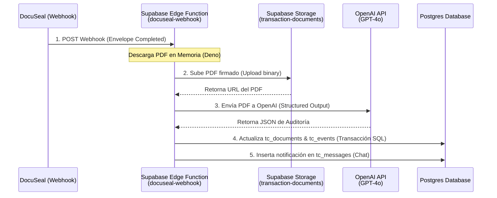

# 🤖 Arquitectura de Integración de IA Nativa — ZHomes
### Procesamiento de Documentos con Supabase Edge Functions, Storage y OpenAI

Esta especificación técnica detalla la arquitectura de integración de Inteligencia Artificial utilizando herramientas 100% nativas del ecosistema de **Supabase** (Edge Functions en Deno/TypeScript, Storage y Database Triggers/Webhooks) para la auditoría y análisis automático de contratos residenciales de bienes raíces firmados en **DocuSeal**.

---

## 1. El Flujo de Procesamiento de Documentos (Pipeline Nativo)

El flujo de procesamiento elimina intermediarios como N8N y ejecuta todo el ciclo de vida del documento dentro de la nube perimetral (edge) de Supabase:



### Paso 1: Configuración del Webhook en DocuSeal
DocuSeal se configura para apuntar su webhook de completado de sobre (`envelope.completed`) a la URL pública de la Edge Function:
`https://[project-ref].supabase.co/functions/v1/docuseal-webhook`
Asegurando el canal mediante un Token de Firma en la cabecera `X-Docuseal-Signature`.

### Paso 2: Descarga en Memoria y Guardado en Supabase Storage
La Edge Function recibe el webhook, descarga el PDF directamente como un array buffer binario utilizando `fetch()` nativo de Deno y lo sube al bucket privado `transaction-documents` mediante el SDK `@supabase/supabase-js` con el rol de `service_role` para evadir políticas RLS restrictivas durante la automatización.

### Paso 3: Análisis y Auditoría con OpenAI
En lugar de extraer texto plano del PDF, la Edge Function envía el archivo binario del PDF completo directamente a la API de OpenAI en un nodo vision/document. GPT-4o analiza la estructura del documento (tablas de contingencias, firmas gráficas y datos de cierre) garantizando cero pérdida de formato.

---

## 2. Código de Producción de la Edge Function (`docuseal-webhook`)

Este código en TypeScript se ejecuta bajo el Deno runtime en Supabase Edge Functions:

```typescript
import { serve } from "https://deno.land/std@0.168.0/http/server.ts"
import { createClient } from "https://esm.sh/@supabase/supabase-js@2.39.8"
import OpenAI from "https://esm.sh/openai@4.28.0"

// Encabezados CORS estándar
const corsHeaders = {
  'Access-Control-Allow-Origin': '*',
  'Access-Control-Allow-Headers': 'authorization, x-client-info, apikey, content-type',
}

serve(async (req) => {
  // Manejo de peticiones preflight (CORS)
  if (req.method === 'OPTIONS') {
    return new Response('ok', { headers: corsHeaders })
  }

  try {
    const SUPABASE_URL = Deno.env.get('SUPABASE_URL')!;
    const SUPABASE_SERVICE_ROLE_KEY = Deno.env.get('SUPABASE_SERVICE_ROLE_KEY')!;
    const OPENAI_API_KEY = Deno.env.get('OPENAI_API_KEY')!;

    const supabase = createClient(SUPABASE_URL, SUPABASE_SERVICE_ROLE_KEY);
    const openai = new OpenAI({ apiKey: OPENAI_API_KEY });

    const payload = await req.json();
    
    // Validar tipo de evento
    if (payload.event !== 'envelope.completed') {
      return new Response(JSON.stringify({ status: 'ignored', reason: 'Not an envelope.completed event' }), {
        headers: { ...corsHeaders, 'Content-Type': 'application/json' },
        status: 200
      });
    }

    const envelopeData = payload.data;
    const documentName = envelopeData.name;
    const downloadUrl = envelopeData.documents[0].download_url;
    const envelopeId = envelopeData.id.toString();

    // 1. Obtener la transacción correspondiente en la base de datos
    // Mapeamos temporalmente mediante el email del comprador o notas en metadatos
    const buyerEmail = envelopeData.submitters.find((s: any) => s.role === 'buyer')?.email;
    
    const { data: transaction, error: txError } = await supabase
      .from('transactions')
      .select('id, client_id, realtor_id')
      .eq('client_id', (await supabase.from('profiles').select('id').eq('email', buyerEmail).single()).data?.id)
      .eq('status', 'under_contract')
      .limit(1)
      .single();

    if (txError || !transaction) {
      throw new Error(`No active transaction found for buyer email: ${buyerEmail}`);
    }

    const transactionId = transaction.id;

    // 2. Descargar PDF firmado desde DocuSeal
    const fileResponse = await fetch(downloadUrl);
    if (!fileResponse.ok) {
      throw new Error(`Failed to download PDF from DocuSeal: ${fileResponse.statusText}`);
    }
    const pdfBlob = await fileResponse.blob();

    // 3. Subir PDF al bucket privado de Supabase Storage
    const storagePath = `deals/${transactionId}/${envelopeId}_signed.pdf`;
    const { data: storageData, error: storageError } = await supabase.storage
      .from('transaction-documents')
      .upload(storagePath, pdfBlob, {
        contentType: 'application/pdf',
        upsert: true
      });

    if (storageError) {
      throw new Error(`Supabase Storage upload failed: ${storageError.message}`);
    }

    const documentUrl = `${SUPABASE_URL}/storage/v1/object/sign/transaction-documents/${storagePath}`;

    // 4. Convertir PDF a Base64 para enviarlo a la API de OpenAI
    const arrayBuffer = await pdfBlob.arrayBuffer();
    const uint8Array = new Uint8Array(arrayBuffer);
    let binary = '';
    for (let i = 0; i < uint8Array.length; i++) {
      binary += String.fromCharCode(uint8Array[i]);
    }
    const pdfBase64 = btoa(binary);

    // 5. Llamada a OpenAI con Structured Outputs (JSON Schema)
    const chatCompletion = await openai.chat.completions.create({
      model: "gpt-4o-2024-08-06",
      messages: [
        {
          role: "system",
          content: `You are an ultra-strict Real Estate Legal Auditor specialized in Kentucky residential transaction contracts (specifically Purchase Agreements).
Analyze the contract and extract key details with absolute fidelity. Do not infer or assume any information.
If a specific clause, contingency, date, or signature is not explicitly stated in the document, you MUST output null or "not_found" for that field.`
        },
        {
          role: "user",
          content: [
            {
              type: "text",
              text: "Audit this signed real estate Purchase Agreement. Extract all requested schema fields."
            },
            {
              type: "input_file",
              file_data: {
                data: pdfBase64,
                mime_type: "application/pdf"
              }
            }
          ]
        }
      ],
      response_format: {
        type: "json_schema",
        json_schema: {
          name: "contract_audit_schema",
          strict: true,
          schema: {
            type: "object",
            properties: {
              document_type: { type: "string", enum: ["Purchase Agreement", "HUD-1", "Addendum", "Disclosure", "Other"] },
              signatures_validated: { type: "boolean" },
              missing_signatures: { type: "array", items: { type: "string" } },
              contingencies_found: {
                type: "array",
                items: {
                  type: "object",
                  properties: {
                    contingency_type: { type: "string", enum: ["inspection", "financing", "appraisal", "home_sale", "other"] },
                    deadline_date: { type: ["string", "null"] },
                    amount: { type: ["number", "null"] },
                    clause_summary: { type: "string" }
                  },
                  required: ["contingency_type", "deadline_date", "amount", "clause_summary"],
                  additionalProperties: false
                }
              },
              audit_pass: { type: "boolean" },
              audit_anomalies: { type: "array", items: { type: "string" } },
              summary_es: { type: "string" }
            },
            required: ["document_type", "signatures_validated", "missing_signatures", "contingencies_found", "audit_pass", "audit_anomalies", "summary_es"],
            additionalProperties: false
          }
        }
      }
    });

    const auditResult = JSON.parse(chatCompletion.choices[0].message.content!);

    // 6. Actualizar base de datos de Supabase en transacción
    const documentStatus = auditResult.audit_pass ? 'approved' : 'reviewing';

    // Registrar o actualizar documento
    const { data: docData, error: docError } = await supabase
      .from('tc_documents')
      .insert({
        transaction_id: transactionId,
        name: documentName,
        document_url: documentUrl,
        status: documentStatus,
        docuseal_envelope_id: envelopeId
      })
      .select('id')
      .single();

    if (docError) throw docError;

    // Registrar evento de auditoría en tc_events
    await supabase
      .from('tc_events')
      .insert({
        transaction_id: transactionId,
        event_type: auditResult.audit_pass ? 'document_audit_passed' : 'document_audit_failed_manual_review_required',
        description: auditResult.audit_pass 
          ? `El documento '${documentName}' pasó la auditoría de IA exitosamente.` 
          : `El documento '${documentName}' falló la auditoría automática. Anomalías: ${auditResult.audit_anomalies.join(', ')}`,
        raw_payload: auditResult
      });

    // Registrar mensaje de chat en tc_messages para el cliente
    await supabase
      .from('tc_messages')
      .insert({
        transaction_id: transactionId,
        sender_id: null, // System notification
        message_text: `Sistema ZHomes: ${auditResult.summary_es}`,
        is_system_notification: true
      });

    return new Response(JSON.stringify({ status: 'success', document_id: docData.id, audit_pass: auditResult.audit_pass }), {
      headers: { ...corsHeaders, 'Content-Type': 'application/json' },
      status: 200
    });

  } catch (error) {
    return new Response(JSON.stringify({ status: 'error', error: error.message }), {
      headers: { ...corsHeaders, 'Content-Type': 'application/json' },
      status: 400
    });
  }
});
```

---

## 3. Resiliencia, Fallbacks y Gestión de Errores Nativa

### A. Límites de Tarifa (Rate Limits) y Timeouts
La ejecución de Supabase Edge Functions tiene un límite máximo de ejecución de **150 segundos**. Para evitar caídas por latencia de OpenAI:
*   Se implementa una política de reintento local dentro de la función utilizando un loop `for` asíncrono con *exponential backoff* para manejar códigos HTTP `429` (Rate Limit) o `503` (OpenAI Overload) antes de fallar la petición.
*   En caso de que OpenAI caiga completamente, el bloque `catch` atrapa el error y actualiza `tc_documents` con estado `pending` o `reviewing` y registra un evento `document_audit_error` para alertar al equipo técnico.

### B. Fallback y Notificación en el CRM (Intervención Humana)
Cuando un documento falla la validación automática (`audit_pass = false`):
1.  **Estado Suspendido:** El documento queda registrado con `status = 'reviewing'`, requiriendo la firma manual del Broker.
2.  **Notificación Realtime en CRM (Supabase Realtime):** 
    *   La inserción de la anomalía en `tc_events` dispara una actualización por Websockets en la aplicación móvil/web del Realtor y el Broker mediante los canales de tiempo real de Supabase (`supabase.channel('tc_events')`).
    *   Esto hace que la tarjeta del documento aparezca inmediatamente destacada en rojo con el listado de campos faltantes identificados por OpenAI, permitiendo que el Broker realice la aprobación manual con un solo switch que cambia el estado a `approved`.
