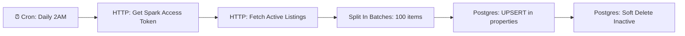
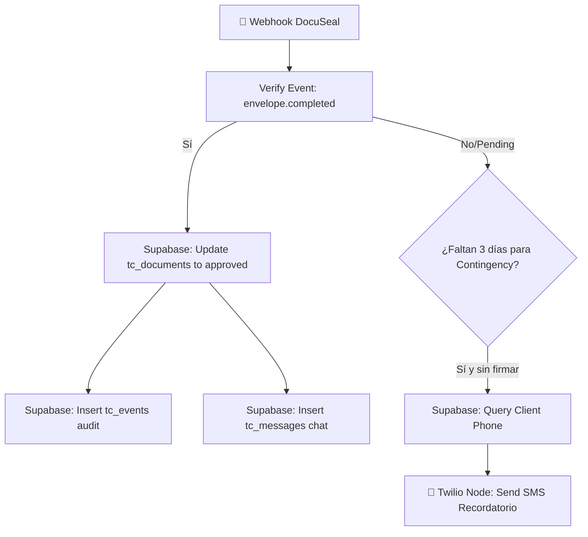

# 🏗️ ZHomes — Especificación de Backend, Esquemas SQL y Componentes UI

Este documento contiene la especificación de diseño técnico para la arquitectura del backend, la base de datos PostgreSQL en Supabase, el motor de valuación CMA Pro, los componentes interactivos móviles y la orquestación de flujos en N8N.

---

## 1. Configuración de Base de Datos y RLS en Supabase (SQL)

El siguiente script configura la base de datos de PostgreSQL habilitando la extensión espacial de PostGIS y las llaves primarias basadas en UUID, además de definir las tablas del Core de transacciones y sus respectivas políticas RLS.

```sql
-- =========================================================================
-- 0. EXTENSIONES Y SEGURIDAD INICIAL
-- =========================================================================
CREATE EXTENSION IF NOT EXISTS "uuid-ossp";
CREATE EXTENSION IF NOT EXISTS "postgis";

-- Tipos enums para control de estados
CREATE TYPE user_role AS ENUM ('client', 'realtor', 'broker');
CREATE TYPE property_status AS ENUM ('active', 'pending', 'sold', 'inactive');
CREATE TYPE transaction_status AS ENUM ('listed', 'under_contract', 'inspection', 'appraisal', 'pre_close', 'closed', 'cancelled');
CREATE TYPE lead_status AS ENUM ('new', 'contacted', 'preapproved', 'searching', 'offer', 'closing');

-- =========================================================================
-- 1. ESQUEMAS DE TABLAS
-- =========================================================================

-- Perfiles de usuario (conectado con auth.users de Supabase)
CREATE TABLE public.profiles (
    id UUID PRIMARY KEY REFERENCES auth.users(id) ON DELETE CASCADE,
    email TEXT UNIQUE NOT NULL,
    full_name TEXT NOT NULL,
    role user_role NOT NULL DEFAULT 'client',
    created_at TIMESTAMP WITH TIME ZONE DEFAULT timezone('utc'::text, now()) NOT NULL
);

-- Propiedades (con datos espaciales geográficos)
CREATE TABLE public.properties (
    id UUID PRIMARY KEY DEFAULT gen_random_uuid(),
    mls_id VARCHAR(100) UNIQUE,
    address TEXT NOT NULL,
    location GEOMETRY(Point, 4326) NOT NULL, -- Coordenadas GPS (SRID 4326)
    price NUMERIC(12, 2) NOT NULL,
    beds INTEGER,
    baths NUMERIC(3, 1),
    gla INTEGER NOT NULL, -- Gross Living Area (sq ft)
    garage INTEGER DEFAULT 0,
    year_built INTEGER,
    status property_status NOT NULL DEFAULT 'active',
    sold_date DATE,
    created_at TIMESTAMP WITH TIME ZONE DEFAULT timezone('utc'::text, now()) NOT NULL
);

-- Índice GIST espacial para consultas de proximidad rápidas
CREATE INDEX properties_location_gist ON public.properties USING gist(location);
CREATE INDEX properties_status_idx ON public.properties(status);

-- Transacciones inmobiliarias (Deals)
CREATE TABLE public.transactions (
    id UUID PRIMARY KEY DEFAULT gen_random_uuid(),
    client_id UUID NOT NULL REFERENCES public.profiles(id),
    realtor_id UUID NOT NULL REFERENCES public.profiles(id),
    property_id UUID NOT NULL REFERENCES public.properties(id),
    status transaction_status NOT NULL DEFAULT 'listed',
    documents JSONB DEFAULT '[]'::jsonb, -- Estructura de documentos asignados
    contingencies_deadline TIMESTAMP WITH TIME ZONE, -- Fecha límite crítica
    created_at TIMESTAMP WITH TIME ZONE DEFAULT timezone('utc'::text, now()) NOT NULL
);

-- Leads globales
CREATE TABLE public.leads (
    id UUID PRIMARY KEY DEFAULT gen_random_uuid(),
    client_id UUID NOT NULL REFERENCES public.profiles(id),
    realtor_id UUID REFERENCES public.profiles(id),
    status lead_status NOT NULL DEFAULT 'new',
    notes TEXT,
    created_at TIMESTAMP WITH TIME ZONE DEFAULT timezone('utc'::text, now()) NOT NULL
);

-- Habilitar RLS en todas las tablas
ALTER TABLE public.profiles ENABLE ROW LEVEL SECURITY;
ALTER TABLE public.properties ENABLE ROW LEVEL SECURITY;
ALTER TABLE public.transactions ENABLE ROW LEVEL SECURITY;
ALTER TABLE public.leads ENABLE ROW LEVEL SECURITY;

-- =========================================================================
-- 2. POLÍTICAS DE ROW LEVEL SECURITY (RLS)
-- =========================================================================

-- Función helper para obtener el rol del usuario autenticado sin loops recursivos
CREATE OR REPLACE FUNCTION public.get_auth_role()
RETURNS user_role SECURITY DEFINER AS $$
    SELECT role FROM public.profiles WHERE id = auth.uid();
$$ LANGUAGE sql;

-- ----------------- profiles Policies -----------------
CREATE POLICY "Profiles: Acceso de lectura para Broker"
    ON public.profiles FOR SELECT
    USING (public.get_auth_role() = 'broker');

CREATE POLICY "Profiles: Acceso de escritura para Broker"
    ON public.profiles FOR ALL
    USING (public.get_auth_role() = 'broker');

CREATE POLICY "Profiles: Acceso de lectura propio"
    ON public.profiles FOR SELECT
    USING (id = auth.uid());

CREATE POLICY "Profiles: Clientes y Realtors pueden editar sus propios datos"
    ON public.profiles FOR UPDATE
    USING (id = auth.uid());

CREATE POLICY "Profiles: Realtors pueden ver perfiles de sus clientes"
    ON public.profiles FOR SELECT
    USING (
        public.get_auth_role() = 'realtor' AND 
        (
            id = auth.uid() OR
            EXISTS (SELECT 1 FROM public.leads l WHERE l.client_id = public.profiles.id AND l.realtor_id = auth.uid()) OR
            EXISTS (SELECT 1 FROM public.transactions t WHERE t.client_id = public.profiles.id AND t.realtor_id = auth.uid())
        )
    );

-- ----------------- properties Policies -----------------
CREATE POLICY "Properties: Lectura pública"
    ON public.properties FOR SELECT
    USING (true);

CREATE POLICY "Properties: Escritura restringida al Broker"
    ON public.properties FOR ALL
    USING (public.get_auth_role() = 'broker');

-- ----------------- transactions Policies -----------------
CREATE POLICY "Transactions: Broker acceso total"
    ON public.transactions FOR ALL
    USING (public.get_auth_role() = 'broker');

CREATE POLICY "Transactions: Clientes pueden ver sus propias transacciones"
    ON public.transactions FOR SELECT
    USING (client_id = auth.uid());

CREATE POLICY "Transactions: Realtors pueden ver y actualizar sus transacciones asignadas"
    ON public.transactions FOR ALL
    USING (public.get_auth_role() = 'realtor' AND realtor_id = auth.uid());

-- ----------------- leads Policies -----------------
CREATE POLICY "Leads: Broker acceso total"
    ON public.leads FOR ALL
    USING (public.get_auth_role() = 'broker');

CREATE POLICY "Leads: Clientes pueden ver y actualizar sus propios leads"
    ON public.leads FOR SELECT
    USING (client_id = auth.uid());

CREATE POLICY "Leads: Realtors pueden ver y actualizar sus leads asignados"
    ON public.leads FOR ALL
    USING (public.get_auth_role() = 'realtor' AND realtor_id = auth.uid());
```

---

## 2. Motor de Valuación "CMA Pro" (SQL)

La siguiente función de PostgreSQL realiza una búsqueda espacial e histórica de propiedades vendidas (Closed) en la base de datos de la MLS de Louisville, KY para calcular el valor promedio ajustado de mercado.

```sql
CREATE OR REPLACE FUNCTION public.calculate_cma_pro(
    target_property_id UUID,
    max_distance_miles DOUBLE PRECISION DEFAULT 1.0,
    gla_variance_percent DOUBLE PRECISION DEFAULT 20.0
)
RETURNS TABLE (
    suggested_price NUMERIC(12, 2),
    min_range NUMERIC(12, 2),
    max_range NUMERIC(12, 2),
    comparables_count INTEGER,
    average_price_per_sqft NUMERIC(8, 2)
) SECURITY DEFINER AS $$
DECLARE
    target_geom GEOMETRY;
    target_gla INTEGER;
    target_beds INTEGER;
    target_baths NUMERIC(3,1);
    target_garage INTEGER;
    target_year INTEGER;
    target_price NUMERIC(12, 2);
    
    -- Constantes monetarias de ajuste del mercado de Louisville
    ADJ_SQFT_VAL NUMERIC := 75.00;
    ADJ_BED_VAL NUMERIC := 7500.00;
    ADJ_BATH_VAL NUMERIC := 5000.00;
    ADJ_GARAGE_VAL NUMERIC := 12000.00;
    ADJ_YEAR_STEP_VAL NUMERIC := 300.00; -- Por año de diferencia
BEGIN
    -- 1. Obtener los atributos de la propiedad a valuar (Sujeto)
    SELECT location, gla, beds, baths, garage, year_built, price
    INTO target_geom, target_gla, target_beds, target_baths, target_garage, target_year, target_price
    FROM public.properties
    WHERE id = target_property_id;

    IF NOT FOUND THEN
        RAISE EXCEPTION 'Propiedad sujeto no encontrada.';
    END IF;

    -- 2. Ejecutar la búsqueda de comparables y consolidación de promedio
    RETURN QUERY
    WITH comparables AS (
        SELECT 
            p.id,
            p.price as sold_price,
            p.gla,
            p.beds,
            p.baths,
            p.garage,
            p.year_built,
            p.sold_date,
            -- Distancia exacta en metros usando PostGIS transformando a geografías
            ST_Distance(p.location::geography, target_geom::geography) as distance_meters,
            -- 3. Calcular ajustes individuales (Principio de Sustitución)
            (
                p.price 
                -- Ajuste GLA
                + ((target_gla - p.gla) * ADJ_SQFT_VAL)
                -- Ajuste Habitaciones
                + ((target_beds - COALESCE(p.beds, 0)) * ADJ_BED_VAL)
                -- Ajuste Baños
                + ((target_baths - COALESCE(p.baths, 0)) * ADJ_BATH_VAL)
                -- Ajuste Garages
                + ((target_garage - COALESCE(p.garage, 0)) * ADJ_GARAGE_VAL)
                -- Ajuste Antigüedad
                + ((target_year - COALESCE(p.year_built, target_year)) * ADJ_YEAR_STEP_VAL)
            ) as adjusted_price
        FROM public.properties p
        WHERE 
            p.id <> target_property_id
            AND p.status = 'sold'
            -- Proximidad espacial: ST_DWithin evalúa usando metros (1 milla = 1609.34 metros)
            AND ST_DWithin(p.location::geography, target_geom::geography, max_distance_miles * 1609.34)
            -- Recencia: Vendidas en los últimos 6 meses
            AND p.sold_date >= (CURRENT_DATE - INTERVAL '6 months')
            -- Superficie equivalente: GLA dentro de la varianza aceptable
            AND p.gla BETWEEN (target_gla * (1 - gla_variance_percent / 100)) 
                          AND (target_gla * (1 + gla_variance_percent / 100))
    ),
    stats AS (
        SELECT 
            COUNT(*)::INTEGER as total_comps,
            AVG(adjusted_price) as avg_price,
            AVG(sold_price / gla) as avg_sqft_price
        FROM comparables
    )
    SELECT 
        ROUND(COALESCE(avg_price, target_price), 2)::NUMERIC(12,2) as suggested_price,
        ROUND(COALESCE(avg_price * 0.95, target_price * 0.95), 2)::NUMERIC(12,2) as min_range,
        ROUND(COALESCE(avg_price * 1.05, target_price * 1.05), 2)::NUMERIC(12,2) as max_range,
        COALESCE(total_comps, 0) as comparables_count,
        ROUND(COALESCE(avg_sqft_price, 0), 2)::NUMERIC(8,2) as average_price_per_sqft
    FROM stats;
END;
$$ LANGUAGE plpgsql;
```

---

## 3. Componentes de Interfaz de Usuario React

A continuación se detalla la implementación del componente interactivo de listados deslizables y del Tinder Swipe Card con rendimiento optimizado.

### A. Estructura de Tarjetas Deslizables (`ZHomesMatchCard.tsx`)
Implementa WAI-ARIA, slot polimórfico, variantes CVA e integración CSS declarativa.

```tsx
import * as React from "react";
import { Slot } from "@radix-ui/react-slot";
import { cva, type VariantProps } from "class-variance-authority";
import { LazyMotion, domAnimation, m, useMotionValue, useTransform } from "framer-motion";
import { DollarSign, Bed, Bath, Maximize } from "lucide-react";
import { cn } from "@/lib/utils";

// Definición de variantes estáticas usando Class Variance Authority
const cardVariants = cva(
  "relative w-full max-w-sm overflow-hidden rounded-2xl bg-card border text-card-foreground shadow-lg transition-shadow duration-300 focus-visible:outline-none focus-visible:ring-2 focus-visible:ring-ring focus-visible:ring-offset-2 select-none touch-none",
  {
    variants: {
      intent: {
        default: "border-border hover:shadow-xl",
        exclusive: "border-primary/40 bg-gradient-to-b from-card to-primary/5 shadow-primary/10",
        alert: "border-destructive/30 hover:border-destructive/60",
      },
      size: {
        sm: "p-4",
        md: "p-6",
      }
    },
    defaultVariants: {
      intent: "default",
      size: "md",
    }
  }
);

export interface PropertyCardProps
  extends React.HTMLAttributes<HTMLDivElement>,
    VariantProps<typeof cardVariants> {
  asChild?: boolean;
  hasActiveOffer?: boolean;
}

// 1. Tarjeta base compatible con el Slot Pattern de Radix UI (Shadcn)
export const ZHomesPropertyCard = React.forwardRef<HTMLDivElement, PropertyCardProps>(
  ({ className, intent, size, asChild = false, hasActiveOffer = false, ...props }, ref) => {
    const Comp = asChild ? Slot : "div";
    return (
      <Comp
        ref={ref}
        data-slot="property-card"
        data-state={hasActiveOffer ? "active-offer" : "idle"}
        className={cn(cardVariants({ intent, size, className }), 
          // Ajuste condicional moderno mediante el selector CSS :has() en Tailwind
          "[&:has([data-slot='active-badge'])]:border-primary/60 [&:has([data-slot='active-badge'])]:p-8"
        )}
        tabIndex={0}
        role="button"
        {...props}
      />
    );
  }
);
ZHomesPropertyCard.displayName = "ZHomesPropertyCard";

// 2. Componente de Tinder Swipe interactivo optimizado para bundle (<5 KB)
interface MatchCardProps extends PropertyCardProps {
  property: {
    id: string;
    address: string;
    price: number;
    beds: number;
    baths: number;
    gla: number;
    image: string;
  };
  onSwipe: (direction: "left" | "right") => void;
}

export const ZHomesMatchCard: React.FC<MatchCardProps> = ({ property, onSwipe, intent, size }) => {
  const x = useMotionValue(0);
  const y = useMotionValue(0);
  
  // Transformaciones para física tridimensional del arrastre (Rotación e Inclinación)
  const rotate = useTransform(x, [-200, 200], [-30, 30]);
  const opacity = useTransform(x, [-200, -150, 0, 150, 200], [0.5, 1, 1, 1, 0.5]);
  const scale = useTransform(x, [-200, 0, 200], [0.95, 1, 0.95]);

  const handleDragEnd = (_event: any, info: any) => {
    const swipeThreshold = 120;
    if (info.offset.x > swipeThreshold) {
      onSwipe("right");
    } else if (info.offset.x < -swipeThreshold) {
      onSwipe("left");
    }
  };

  return (
    <LazyMotion features={domAnimation}>
      <m.div
        drag
        dragConstraints={{ left: 0, right: 0, top: 0, bottom: 0 }}
        style={{ x, y, rotate, opacity, scale }}
        onDragEnd={handleDragEnd}
        className="w-full flex justify-center cursor-grab active:cursor-grabbing"
        whileDrag={{ scale: 1.02 }}
      >
        <ZHomesPropertyCard
          intent={intent}
          size={size}
          aria-label={`Propiedad en ${property.address}`}
        >
          {/* Imagen de propiedad */}
          <div className="relative aspect-[4/3] w-full overflow-hidden rounded-xl bg-muted">
            
            {/* Sello tridimensional condicional en hover/has */}
            <div 
              data-slot="active-badge"
              className="absolute top-3 right-3 hidden data-[state=active]:block bg-primary text-primary-foreground px-3 py-1 rounded-full text-xs font-semibold uppercase tracking-wider"
              data-state={property.price < 300000 ? "active" : "idle"}
            >
              Oferta Activa
            </div>
          </div>

          {/* Información */}
          <div className="mt-4 space-y-2">
            <div className="flex justify-between items-start">
              <h3 className="font-bold text-lg leading-tight line-clamp-1">{property.address}</h3>
              <div className="flex items-center text-primary font-extrabold text-lg">
                <DollarSign className="h-4 w-4" />
                {property.price.toLocaleString("en-US")}
              </div>
            </div>

            {/* Fila de características técnicas */}
            <div className="flex justify-between border-t pt-3 text-muted-foreground text-sm">
              <div className="flex items-center gap-1">
                <Bed className="h-4 w-4" />
                <span>{property.beds} Hab</span>
              </div>
              <div className="flex items-center gap-1">
                <Bath className="h-4 w-4" />
                <span>{property.baths} Baños</span>
              </div>
              <div className="flex items-center gap-1">
                <Maximize className="h-4 w-4" />
                <span>{property.gla.toLocaleString()} ft²</span>
              </div>
            </div>
          </div>
        </ZHomesPropertyCard>
      </m.div>
    </LazyMotion>
  );
};
```

---

## 4. Especificación de Automatización de Backend (N8N)

El motor de automatización en N8N se compone de dos flujos de trabajo clave para asegurar la sincronización del inventario y la validación contractual.

### Flujo A: Sincronización Diaria de Spark MLS

Este workflow se ejecuta mediante un temporizador cron e implementa sincronización e inactivación por soft-delete en Supabase.



#### Nodos e Integraciones del Workflow A:
1.  **Interval Trigger (Cron):** Configurado para ejecutarse todos los días a las `02:00` AM (horario del este).
2.  **HTTP Request Node (Token Access):** Realiza una petición `POST` al endpoint de la API de Spark MLS para intercambiar credenciales por un Token Bearer OAuth2.
3.  **HTTP Request Node (Fetch API):** Consulta `/v1/listings` filtrando por `Status = Active` y geolocalizaciones en Louisville, KY.
4.  **Item Lists Node:** Procesa por lotes (Batch processing de 100 registros) para mitigar consumo de RAM en el servidor.
5.  **Postgres Node (Supabase DB):** Ejecuta una sentencia SQL de inserción y actualización (`INSERT ON CONFLICT`) mapeando las propiedades. Utiliza PostGIS para poblar la columna de coordenadas:
    ```sql
    INSERT INTO public.properties (mls_id, address, location, price, beds, baths, gla, year_built, status)
    VALUES (
      $1, $2, 
      ST_SetSRID(ST_MakePoint($3, $4), 4326), -- Longitud, Latitud
      $5, $6, $7, $8, $9, 'active'
    )
    ON CONFLICT (mls_id) 
    DO UPDATE SET 
      price = EXCLUDED.price,
      status = 'active',
      gla = EXCLUDED.gla;
    ```
6.  **Soft-Delete Execution Node (Postgres):** Al terminar la importación exitosa de los lotes, ejecuta un script para marcar en estado `inactive` aquellas propiedades que ya no están activas en el MLS comercial:
    ```sql
    UPDATE public.properties
    SET status = 'inactive'
    WHERE status = 'active'
      AND created_at < NOW() - INTERVAL '1 day'; -- Si no fue actualizada en el último ciclo diario
    ```

---

### Flujo B: Integración DocuSeal y Alerta de Contingencias

Workflow activado por webhooks para gestionar el ciclo de firma digital de contratos y la comunicación a través de Twilio.



#### Nodos e Integraciones del Workflow B:
1.  **Webhook Trigger Node:** Expone una URL pública y segura escuchando eventos procedentes de la instancia local de DocuSeal.
2.  **Switch Node (Event Filter):** Filtra según la propiedad del evento.
    *   Si el evento es `envelope.completed` ➔ Actualiza base de datos.
    *   Si el evento es `envelope.created` o `envelope.sent` ➔ Monitorea contingencias.
3.  **Supabase Node (Aprobación Contractual):**
    *   Cambia el estado del registro de la tabla `public.transactions` o de su correspondiente documento en `public.tc_documents` a `approved`.
    *   Ejecuta una inserción SQL en `public.tc_events` para auditar el cumplimiento:
        ```sql
        INSERT INTO public.tc_events (transaction_id, description)
        VALUES ('{{$json.body.transaction_id}}', 'Contrato firmado digitalmente a través de DocuSeal.');
        ```
    *   Inserta un registro automático en la tabla `public.tc_messages` con el rol de `system` en español:
        ```sql
        INSERT INTO public.tc_messages (transaction_id, sender_name, content, role)
        VALUES ('{{$json.body.transaction_id}}', 'ZHomes AI', '¡Buenas noticias! El contrato ha sido firmado digitalmente por todas las partes y ha sido verificado con éxito.', 'system');
        ```
4.  **Date/Time & Schedule Node (Escalación por SMS):**
    *   Un Cron Node corre cada mañana a las `09:00` AM.
    *   Revisa las transacciones en estado `under_contract` cuya columna `contingencies_deadline` se encuentre en un rango de exactamente `NOW() + INTERVAL '3 days'`.
    *   Cruza contra `public.tc_documents` para comprobar si el documento obligatorio del checklist sigue en estado `pending`.
5.  **Twilio Node (Notificación Push/SMS):**
    *   Si el checklist sigue incompleto a 3 días del vencimiento legal, el flujo extrae el número telefónico del cliente de `public.profiles` y utiliza el nodo nativo de **Twilio** para enviar un mensaje SMS/WhatsApp bilingüe personalizado:
        > *"Hola {{ $json.full_name }}, te recordamos que tu firma para el Contrato en la propiedad {{ $json.address }} está pendiente. El plazo de contingencia vence en 3 días. Por favor entra a tu Deal Room para firmar: https://zhomesapp.com/deal/{{ $json.transaction_id }}"*
